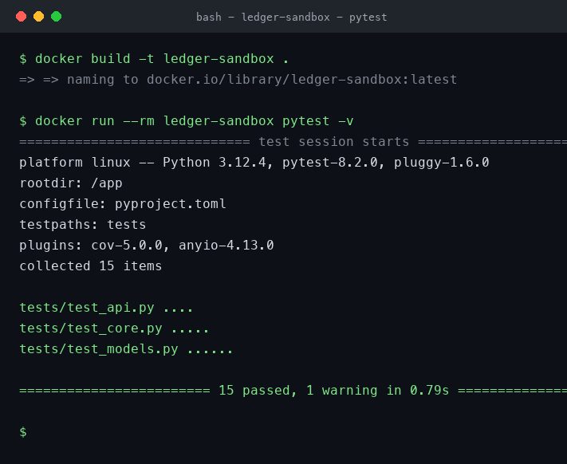

# python-evaluation-sandbox

A small, deliberately realistic Python project that lives inside Docker. It
contains a budgeting **ledger** library plus a minimal **FastAPI** service, and
a `pytest` suite that runs **green inside the container**.

The point of this repo is to rehearse a common live engineering screen: you are
handed a `Dockerfile` and a repo whose tests are red because of dependency
drift, and you have to get `pytest` green inside an isolated environment. See
[`BROKEN_BRANCH.md`](./BROKEN_BRANCH.md) for a worked diagnosis-and-fix
walkthrough.

## What's inside

```
src/ledger/
  models.py   # Pydantic v2 Transaction + Category
  core.py     # Ledger: balance / income / spending / grouping / date windows
  api.py      # FastAPI app factory (/health, /transactions, /summary)
tests/
  test_models.py
  test_core.py
  test_api.py
Dockerfile     # pinned base image, isolated venv, runs pytest on start
pyproject.toml # intentionally version-sensitive pins
```

## Dependency choices (why the pins matter)

The library uses **Pydantic v2-only** APIs (`field_validator`, `model_config`,
`model_dump`, `model_validate`). The API is tested through Starlette's
`TestClient`, which imports **httpx**. That means three families have to line
up: `fastapi`, `starlette`, and `httpx`. The pins in `pyproject.toml` are a
known-good set. Nudging any one of them out of range is what breaks the build —
which is the whole exercise.

## Run it with Docker (recommended)

```bash
# Build the image (installs into an isolated /opt/venv inside the image)
docker build -t ledger-sandbox .

# Run the test suite (this is the container's default command)
docker run --rm ledger-sandbox

# Verbose run
docker run --rm ledger-sandbox pytest -v

# With coverage
docker run --rm ledger-sandbox pytest --cov=ledger --cov-report=term-missing
```

A green run looks like this:



## Run it locally (without Docker)

```bash
python3 -m venv .venv
source .venv/bin/activate
pip install ".[dev]"
pytest -v
```

## Run the API

```bash
# inside the container
docker run --rm -p 8000:8000 ledger-sandbox ledger-serve
# then:
curl localhost:8000/health
curl -X POST localhost:8000/transactions \
  -H 'content-type: application/json' \
  -d '{"id":"a","amount":"1000.00","category":"income","occurred_at":"2024-01-01"}'
curl localhost:8000/summary
```

## The broken-tests exercise

There is a deliberately broken state documented in
[`BROKEN_BRANCH.md`](./BROKEN_BRANCH.md), reproducible on the `broken-deps`
branch:

```bash
git checkout broken-deps
docker build -t ledger-sandbox:broken .   # or pip install locally
docker run --rm ledger-sandbox:broken      # tests fail
```

The walkthrough explains how to read the traceback, identify the conflicting
pin, and restore green.

## License

MIT
